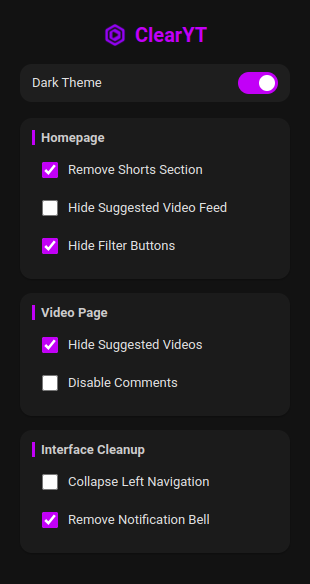

#  ClearYT – Focus Mode for YouTube

**ClearYT** is a Chrome browser extension designed to eliminate distractions from YouTube, making it easier to stay focused while studying or working.

---

## 🚀 Features

- 🎛 **Customize what to hide:**

### 🏠 Homepage
- Remove Shorts Section
- Hide Suggested Video Feed
- Hide Filter Buttons

### 🎬 Video Page
- Hide Suggested Videos
- Disable Comments

### 🧹 Interface Cleanup
- Collapse Left Navigation
- Remove Notification Bell

### 🌙 Appearance
- Dark Theme

- 🔄 **Smart Navigation Detection** – Applies changes even when navigating without reloading
- 💾 **Remembers Preferences** – Your settings persist between sessions

---

## 📦 Installation

1. Clone or download this repository
2. Go to `chrome://extensions/` in your browser
3. Enable **Developer mode**
4. Click **Load unpacked** and select this folder

---

## 🖼️ Icon Attribution

Icon by [Icons8](https://icons8.com)

---

Enjoy a cleaner, calmer YouTube. 🎧🧘‍♂️  
